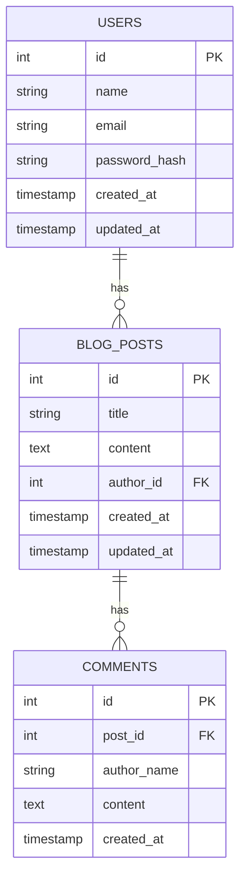

## Blogging MD

This is a simple blogging application written in Go.

### Features

- User Authentication
- Blog Posts
- Comments
- Pagination
- Search

### How to run

- Requirements
    - Docker
    - Docker Compose

- Run
  ```bash
  docker-compose up -d
  ```
  
### Database Schema


### How to use

- Register
    - Endpoint: `/register`
    - Method: `POST`
    - Body
      ```json
      {
        "name": "John Doe",
        "email": "john@example.com",
        "password": "password"
      }
      ```
        - Response
          ```json
          {
            "code": 200,
            "status": "Successfully Registered",
            "data": {
              "id": "1",
              "name": "John Doe",
              "email": "john@example.com"
          }
          ```
- Login
- Endpoint: `/login`
- Method: `POST`
- Body
  ```json
  {
    "email": "john@example.com",
    "password": "password"
  }
  ```
    - Response
      ```json
      {
        "code": 200,
        "status": "Successfully Logged In",
        "data": {
          "token": "Token"
        }
      }
    ```
